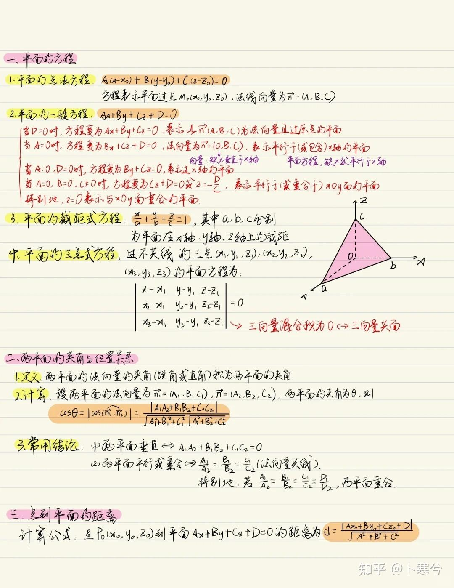
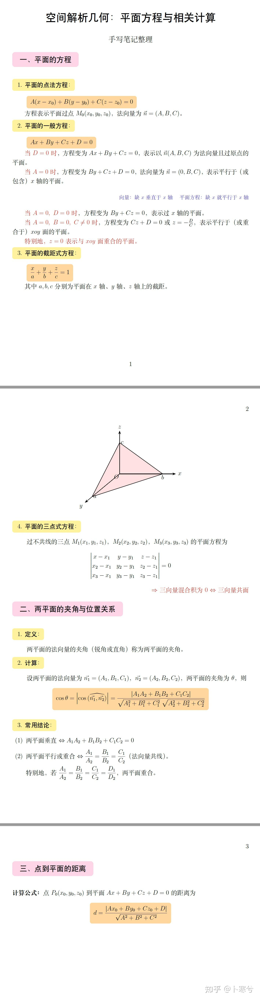

# 9.9 DeepSeek V4.1 Flash开启内测

DeepSeek 又更新了。

9 月 8 日下午，DeepSeek 在官方交流群宣布，DeepSeek V4.1 Flash 中间版本正式开启内测。

按照官方给出的信息，这次 V4.1 Flash 采用了新的模型结构，并且原生支持多模态。DeepSeek 对新模型的描述也非常直接：能力更强、速度更快，同时成本更低。

现在开发者已经可以通过 API 抢先体验。调用时无需修改原来的 `base_url`，只需要把模型名称改为 `deepseek-v4.1-flash-expires-on-0910`。

目前的 API 计费与 DeepSeek V4 Flash 相同，每个账号限制 20 并发。模型名字直接带上了 `expires-on-0910`，按照目前公布的信息，这个中间测试版本将在 9 月 10 日过期。

这次更新的重点是多模态能力。

来做个测试。给 V4.1 Flash 一页空间解析几何笔记，要求模型尽可能还原里面的手写文字、公式、高亮、排版和几何示意图，最终输出一份 LaTeX PDF。

原始笔记里既有不同颜色的手写内容，也有平面方程、矩阵、分式和三维坐标图。

V4.1 Flash 最终生成了一份三页 PDF。文字和公式基本还原，原图中的黄色、粉色和橙色重点也被保留下来，三维几何示意图同样重新画了出来。红色高亮没有完全复刻，但没有破坏整份文档的结构。

这个过程中，模型先要分清标题、正文、公式和批注，再理解几何图里的顶点、坐标轴、空间与图层关系，最后把这些内容转成 LaTeX 和绘图代码。它把一张图片直接变成了一份有结构、可以继续编辑的文档，效果非常不错。

如果你的工作里经常需要整理截图、图表、PDF 或手写材料，在到期前，这个模型值得一试。

<!-- 测试与图片来源：知乎作者卜寒兮 https://www.zhihu.com/question/2080678583714977593/answer/2080713683731212067 -->
